# Learn These 15 No-Code Web Scraping Software, Complete Data Collection in Three Minutes

Getting data off websites used to mean hiring developers or spending weeks learning to code. Now you can point, click, and walk away with clean spreadsheets in minutes. Whether you're tracking competitor prices, building prospect lists, or pulling research data, the right no-code scraper changes everything. This guide walks through the platforms doing the heavy lifting for sales teams, marketers, researchers, and anyone tired of copy-pasting data by hand. Expect tools that handle JavaScript sites, manage proxies automatically, and export straight to your favorite apps.

---

## [Browse AI](https://www.browse.ai)

Cloud-based automation turning any website into live spreadsheets and APIs without writing code.

Browse AI has carved out serious credibility since launching in 2021, now serving over 500,000 users worldwide who've automated 29 million tasks. The platform centers on teaching "robots" to scrape through a visual point-and-click workflow—no scripts, no XPath selectors. Once trained, these robots handle pagination, infinite scroll, login-protected content, and dynamic JavaScript automatically.

What makes Browse AI stand out is how it adapts to website changes. Most scrapers break when a site updates its layout, forcing you back to square one. Browse AI monitors page structure shifts and self-adjusts extraction logic, cutting maintenance to near zero. You also get built-in scheduling, so robots run hourly, daily, or on custom intervals—feeding fresh data to Google Sheets, APIs, or 7,000+ apps via Zapier and Make integrations.

Real users highlight Browse AI's ability to handle tricky scenarios: price monitoring across e-commerce sites, scraping LinkedIn company data for lead gen, pulling job listings from multiple boards, and extracting real estate listings at scale. The Chrome extension simplifies setup further—visit a page, click what you need, and Browse AI generates the scraper instantly. Prebuilt templates for popular sites (Amazon, LinkedIn, Google Maps) let you extract data in two clicks. Plus, managed services handle complex projects when you need custom scrapers built and maintained by their team.

***

## [Apify](https://www.apify.com)

Full-stack cloud platform combining 5,000+ ready-made scrapers with custom code flexibility for any scale.

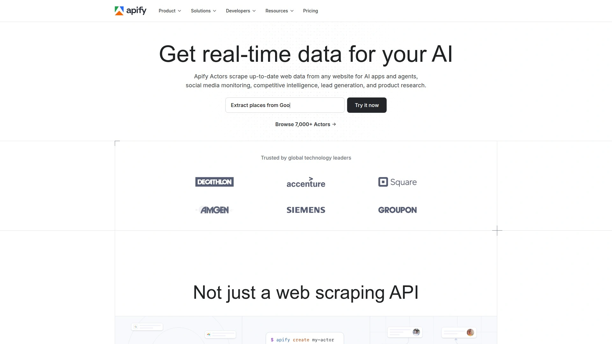

Apify earned its #1 Capterra ranking by balancing power and accessibility. Non-technical users browse a massive marketplace of prebuilt "Actors"—scrapers for Google Maps, Amazon, Instagram, LinkedIn, and thousands more—that run with zero coding. Developers get an open-source SDK (Crawlee) for building sophisticated Python or JavaScript scrapers, plus cloud infrastructure handling millions of pages daily.

The platform shines at enterprise scale. One retail analytics company migrated 70 scrapers to Apify, scaled from 2 million to 5 million pages scraped per day, and cut AWS costs by 90%. Apify's proxy rotation, browser automation, and anti-blocking tools prevent bans automatically. Data exports to JSON, CSV, or feeds directly into Google Sheets, databases, and CRMs. Scheduling, monitoring, and webhooks keep workflows automated. Recent AI integrations let you feed scraped data straight into LLMs for analysis. Pricing starts at $39/month with a generous free tier offering $5 monthly credit.

***

## [Octoparse](https://www.octoparse.com)

Visual no-code scraper with AI auto-detection, 24/7 cloud execution, and hundreds of site-specific templates.

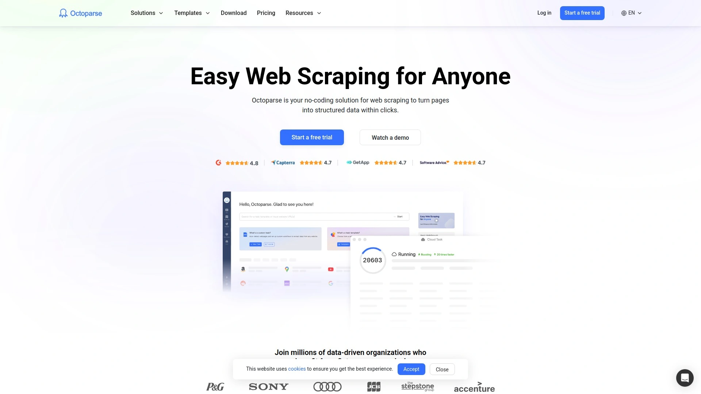

Octoparse built its reputation on making complex scraping simple. The visual workflow designer lets you interact with a built-in browser, clicking data to extract—each action becomes a flowchart block you can debug and adjust. AI-powered Auto-Detection scans page structure and proposes complete workflows including pagination in one click, perfect for non-technical users. For trickier jobs, manual mode handles AJAX, infinite scroll, dropdown menus, and login walls with configurable wait times and form fills.

Cloud scraping runs tasks on Octoparse servers 24/7, so your computer stays free. Built-in IP rotation and CAPTCHA solving (on higher plans) prevent blocks. Data exports to Excel, CSV, JSON, or directly into MySQL, MongoDB, and Google Sheets. Templates for Amazon, Twitter, Yelp, Zillow, and hundreds of other sites let you start extracting immediately. Users praise Octoparse for recruitment (scraping LinkedIn, Monster, Glassdoor), e-commerce price tracking, and real estate data collection. Plans start at $99/month, with a free tier for testing.

***

## [Zyte API](https://www.zyte.com)

All-in-one scraping API combining automatic unblocking, browser rendering, and AI-powered extraction.

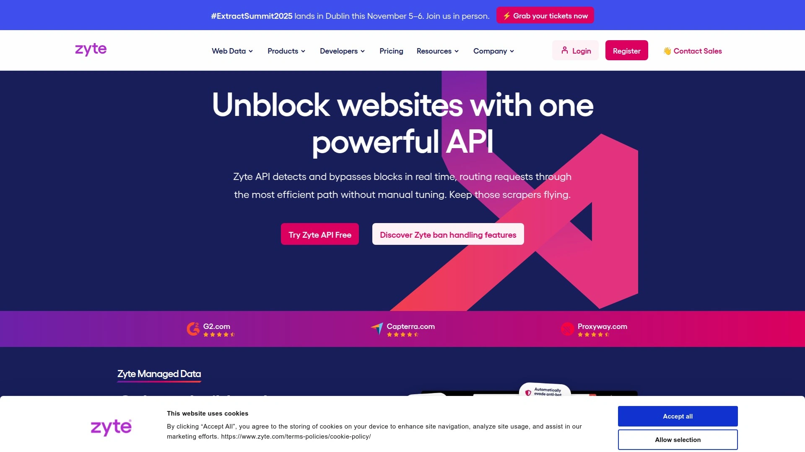

Zyte API (formerly Scrapy Cloud) delivers the most powerful automated unblocking on the market. Instead of managing proxies yourself, Zyte intelligently selects the leanest techniques to keep crawls healthy—rotating IPs across 195+ countries, handling CAPTCHAs, and mimicking human behavior. The built-in headless browser renders JavaScript-heavy sites at scale, a step beyond third-party solutions. AI-powered extraction eliminates manual parsing code—describe what you want in plain English, and Zyte returns structured JSON.

For no-code users, AI spider templates cover e-commerce, Google search results, articles, and job postings. Simply input target URLs and optional parameters, then download data as CSV, JSON, or XML. Developers appreciate Zyte's flexibility: pay-per-request pricing (no monthly fees), seamless Scrapy integration, and end-to-end automation with custom clicks, scrolling, form fills, and geolocation. Built-in compliance features and enterprise-grade support make Zyte ideal for teams scraping at serious volume. Free trial includes $5 credit.

***

## [Bright Data](https://www.brightdata.com)

Industry-leading proxy network (72 million IPs) plus comprehensive scraping tools and managed data services.

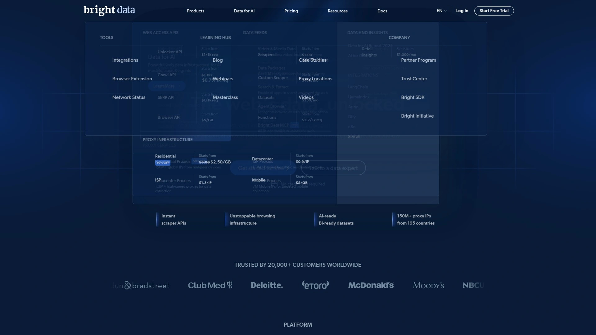

Bright Data dominates the proxy and scraping infrastructure space. Their massive residential, datacenter, ISP, and mobile proxy pools span 195 countries, giving access to virtually any location. The scraping suite includes Web Unlocker (bypasses CAPTCHAs and anti-bot protection automatically), Scraping Browser (headless Chrome API for JavaScript-heavy sites), and a no-code IDE for building visual workflows without developers.

What sets Bright Data apart is scale and compliance. Fortune 500 companies, researchers, and NGOs trust it for ethical, GDPR/CCPA-compliant data collection. The platform handles price tracking, ad verification, SEO research, and competitive intelligence at enterprise volume. Prebuilt datasets cover common use cases, or hire their managed services team for custom scraping projects. Users note the learning curve—Bright Data offers advanced features that beginners might find overwhelming—but once configured, it delivers unmatched reliability and success rates. Pricing is custom based on usage.

***

## [Descript](https://www.descript.com)

Text-based video editor with high-accuracy auto-captions, translation, and collaborative editing workflows.

Descript reimagines video editing by letting you edit audio and video via text transcript. The AI subtitle generator achieves 95%+ accuracy, automatically removes filler words, and translates captions into 20+ languages. You simply upload video, get an editable transcript, and customize caption style—fonts, colors, animations—to match your brand. Changes to the transcript update the video automatically.

Beyond subtitles, Descript includes full editing features: trim clips, add B-roll, insert sound effects, even overdub corrections with AI voice cloning. Real-time collaboration lets teams work together, and direct YouTube export streamlines publishing. The free plan offers limited usage; Creator plans start at $15/month. Users love Descript for podcasts, YouTube videos, webinars, and social media content where accessibility and engagement depend on well-styled captions.

***

## [ParseHub](https://www.parsehub.com)

Free visual scraper handling complex sites with AJAX, dropdowns, and multi-level navigation.

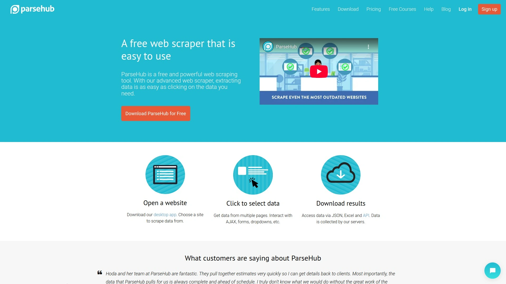

ParseHub gives you a desktop app (Windows, Mac, Linux) with a point-and-click interface for selecting data. It excels at interactive websites—handling AJAX-loaded content, form fills, dropdown selections, and recursive scraping through multiple page levels. IP rotation prevents blocks, and scheduling automates regular data collection. Data exports to JSON, Excel, CSV, or integrates with Dropbox and AWS S3 for cloud storage.

The free plan is surprisingly generous: unlimited local scraping with up to 200 pages per run, though cloud runs and advanced features require paid tiers. ParseHub's learning curve is steeper than some competitors—users report needing time to master complex projects—but documentation, video tutorials, and responsive support help. It's popular among recruiters scraping job boards, marketers pulling competitor data, and analysts gathering public datasets. Pricing starts around $150/month for professional plans.

***

## [Phantombuster](https://www.phantombuster.com)

Cloud automation platform scraping and automating LinkedIn, Instagram, Twitter, and 100+ social networks.

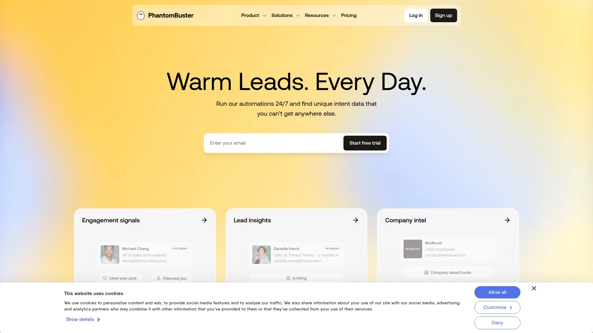

Phantombuster specializes in social media automation via "Phantoms"—prebuilt scripts performing specific tasks like LinkedIn profile scraping, Twitter follower collection, Instagram hashtag exploration, or Google Maps business extraction. You chain Phantoms into Workflows for multi-step automation: find leads on LinkedIn Sales Navigator, extract contact info, send connection requests, and push data to your CRM—all hands-free.

Browserless cloud execution means automations run 24/7 without keeping your computer on. Over 2.5 million users automate 270,000+ tasks daily for lead gen, social selling, and outreach sequences. Integration with Google Sheets, Airtable, and HubSpot keeps data flowing. The main risk? LinkedIn and other platforms actively detect bots—users must configure delays and limits carefully to avoid account bans. Plans start around $59/month, with a free trial (though limited to 2 hours usage).

***

## [Listly](https://www.listly.io)

Lightweight Chrome extension scraping lists and tables into Excel with one-click multi-tab extraction.

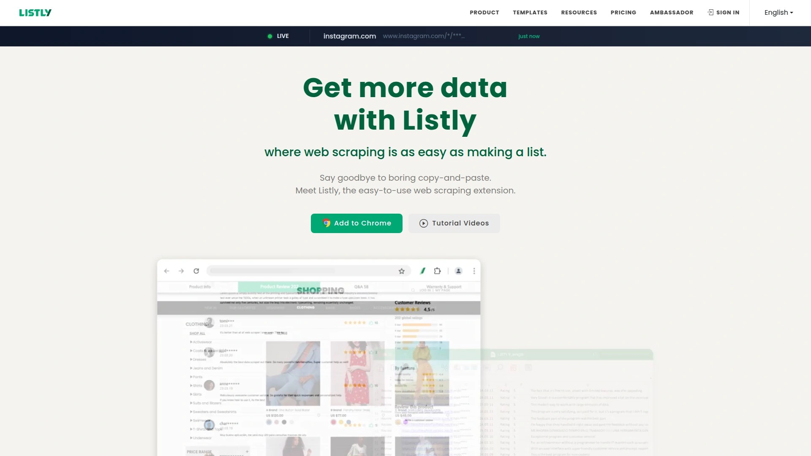

Listly keeps things dead simple: install the Chrome extension, visit a page, click the icon, and Listly extracts visible data into spreadsheet format. It auto-detects tables and lists, handles pagination ("load more" buttons or infinite scroll), and lets you scrape multiple browser tabs simultaneously—merging results into one sheet. Premium features include scheduling, API access, proxy support, and export to CSV, JSON, or Google Sheets.

The free plan scrapes up to 10 URLs daily with basic features, making Listly accessible for casual users. Paid tiers start at $30/month, unlocking batch processing, auto-scroll/click automation, and higher limits. Users appreciate Listly for quick jobs: scraping search results, collecting product listings, pulling contact directories, or extracting real estate data. It won't handle complex multi-level scraping, but for straightforward list extraction, Listly delivers speed and simplicity. Over 200,000 users rely on it daily.

***

## [Kadoa](https://www.kadoa.com)

AI-driven scraper where you describe data in plain English—no selectors, no code, fully self-healing.

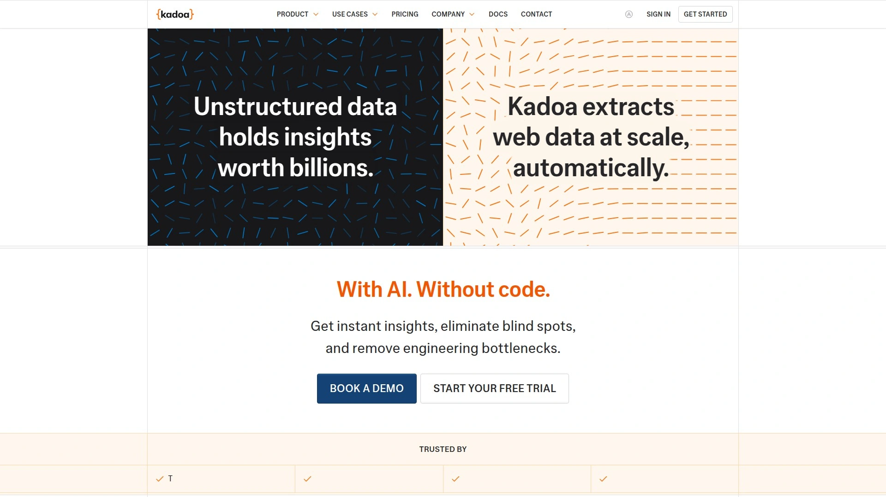

Kadoa represents the next generation of AI-first scraping. Instead of clicking elements or writing XPath, you describe what you want in natural language: "Extract product names, prices, and ratings." Kadoa's AI agents figure out how to navigate the site, extract data, clean it, and structure it automatically. When websites change layouts, self-healing algorithms adapt extraction logic without manual fixes.

The platform handles complex transformations—cleaning, normalizing, and formatting data—so you get usable datasets immediately. API-first design feeds data directly into apps, databases, or spreadsheets via webhooks and integrations. Kadoa scales to millions of records and offers flexible deployment (cloud, on-premises, or VPC) for enterprises. It's ideal for non-technical teams needing reliable data pipelines and developers tired of maintaining brittle custom scrapers. Pricing is usage-based; free trial available.

***

## [ScrapingBee](https://www.scrapingbee.com)

Developer-focused API handling headless browsers, proxy rotation, and AI extraction with simple code snippets.

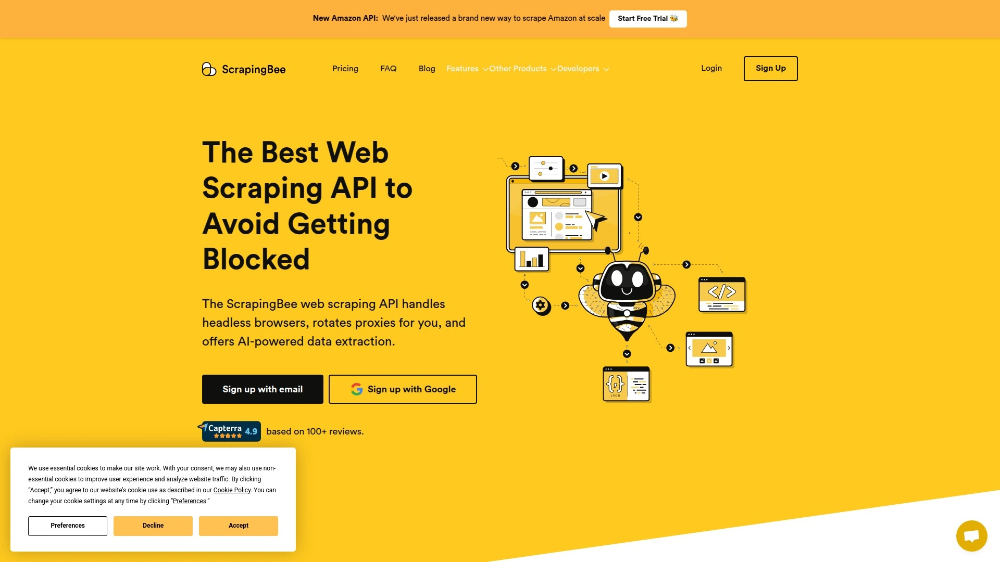

ScrapingBee simplifies scraping for developers by wrapping complex tasks (proxy management, JavaScript rendering, CAPTCHA solving) into a single API call. Send a URL, get back fully-rendered HTML—no managing your own browser fleet. JavaScript rendering supports React, Vue, Angular, and other frameworks. Large proxy pool bypasses rate limits, and AI extraction lets you describe data in plain English to get structured JSON output.

The API works with any programming language via REST calls, with official SDKs for Python, Node.js, and Ruby. Custom scraping scenarios use JavaScript injection and custom headers. ScrapingBee excels at general web scraping (real estate, price monitoring, reviews), data extraction with built-in rules, and screenshot capture. Free tier includes 1,000 API calls; paid plans start at $49/month. Users praise documentation quality and reliable success rates.

***

## [Import.io](https://www.import.io)

Enterprise-grade managed data extraction with AI-powered pipelines, compliance, and automated monitoring.

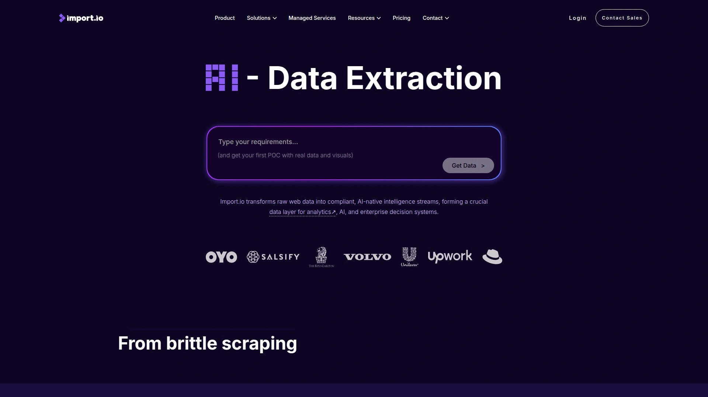

Import.io targets large organizations needing scalable, compliant web data. The platform offers a point-and-click extractor builder—train extractors on complex, authenticated, and dynamic sites in under 5 minutes. AI maps data into clean schemas automatically, handles pagination and multi-page extraction, and self-heals when websites change. PII masking, audit trails with screenshot capture, and scheduled extraction ensure compliance and data provenance.

Data exports to JSON, CSV, Google Sheets, or feeds via API into analytics tools and databases. For hands-off teams, Import.io's managed services build, monitor, and maintain scrapers end-to-end. The platform runs on a global network of residential IPs, handling thousands of sites simultaneously. Use cases include e-commerce market intelligence, competitive analysis, and data integration for analytics. Pricing starts at $299/month for self-service; enterprise plans offer custom features.

***

## [Diffbot](https://www.diffbot.com)

AI-powered extraction with a 246M+ entity Knowledge Graph covering organizations, people, products, and articles.

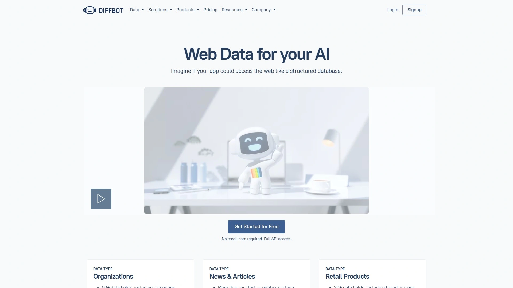

Diffbot uses computer vision and machine learning to "see" web pages like humans do, extracting structured data from any site without custom rules. Automatic data extraction APIs handle articles, products, and discussions—returning clean JSON. Crawlbot enables web-wide crawling across entire domains. The crown jewel is Diffbot's Knowledge Graph: a queryable database of 246 million organizations, 1.6 billion articles, and trillions of interconnected facts scraped from the public web.

NLP features analyze sentiment, infer relationships, and identify entities. Diffbot suits enterprises building knowledge bases, conducting competitive intelligence, or feeding data into AI models. Pricing tiers range from a free plan (10,000 credits, 5 calls/minute) to enterprise custom plans. Users note the learning curve for advanced features, and credit-based pricing requires careful monitoring, but Diffbot's accuracy and scale are hard to beat for complex data needs.

***

## [Instant Data Scraper](https://chromewebstore.google.com/detail/instant-data-scraper)

Completely free Chrome extension with AI auto-detection—no setup, unlimited scraping, instant CSV export.

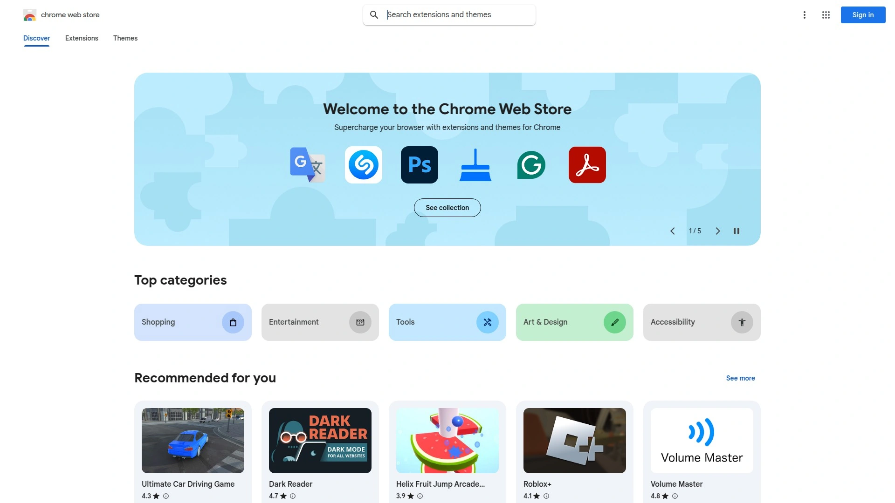

Instant Data Scraper wins on simplicity and cost: install the extension, visit a page, click the icon. AI heuristics predict relevant data patterns and extract tables or lists automatically. Toggle between detected datasets with "Next/Previous" buttons, manually adjust selections if needed, configure pagination for multi-page scraping, then export to CSV or copy to clipboard. No signup required, no usage limits, totally free.

The extension handles dynamic content and infinite scroll. While it lacks advanced customization and only works in Chrome, its zero-cost, zero-friction approach makes it perfect for quick jobs: scraping search results, pulling product info, collecting directory listings, or extracting lead data. Over 1 million users trust it for fast, no-code data extraction. For anyone needing occasional scraping without investing in paid tools, Instant Data Scraper delivers surprising capability.

***

## [Hexomatic](https://www.hexomatic.com)

No-code automation hub combining web scraping with 100+ ready-made workflows and native ChatGPT/Gemini integration.

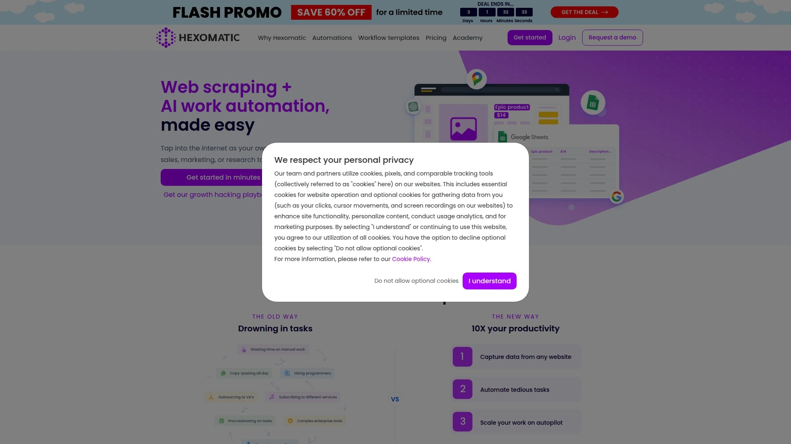

Hexomatic goes beyond scraping by bundling data extraction with task automation. Point-and-click scraping recipes extract products, leads, listings, and content from any site. Then chain scrapers with 100+ automations: find email addresses, validate contacts, analyze tech stacks, translate content, get traffic estimates, or use AI to summarize and rewrite at scale. Native ChatGPT and Google Gemini integrations let you perform human-like tasks—writing, classification, analysis—directly inside workflows.

Cloud-based execution runs multiple projects simultaneously with IP rotation to avoid blocks. Data exports to CSV, JSON, or Google Sheets. Use cases span e-commerce (scrape + optimize product listings with AI), lead gen (scrape Google Maps + enrich with emails and social profiles), and content ops (scrape articles + translate + post to WordPress). Hexomatic also offers done-for-you scraping services for custom projects. Plans start at $49/month.

***

## [ScrapeStorm](https://www.scrapestorm.com)

AI-powered desktop app (Windows, Mac, Linux) with Smart Mode auto-detection and visual Flowchart Mode for custom logic.

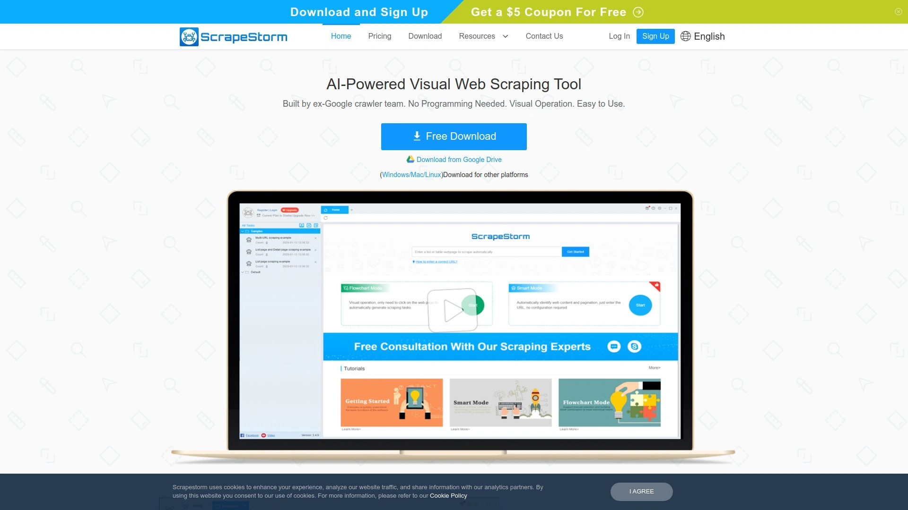

ScrapeStorm balances automation and control via two modes. Smart Mode uses AI to identify lists, tables, and pagination automatically—just enter a URL and ScrapeStorm extracts data. Flowchart Mode gives visual workflow building for complex scraping: simulate clicks, form fills, multi-level navigation, and conditional logic without code. Built-in rotating proxies, task scheduling, and cloud service (run jobs on their servers) handle scale and automation.

Data exports to Excel, CSV, TXT, HTML, or databases (MySQL, MongoDB). ScrapeStorm supports all major operating systems and offers RESTful API access for integrating scraping into other apps. Use cases include e-commerce price monitoring, job board data collection, and academic research. The free Starter plan allows 10 tasks and 100 rows/day export. Professional plans start at $39.99/month, with higher tiers unlocking unlimited tasks, scheduling, and file downloads.

***

## FAQ Common Questions

**Can these tools scrape websites that require login credentials?**
Yes, most platforms listed—Browse AI, Octoparse, ParseHub, Import.io, and WebHarvy—support authenticated extraction where you provide login details, and the scraper handles the rest. Some tools save session cookies to stay logged in across runs.

**How do I avoid getting blocked or banned when scraping at scale?**
Top scrapers include proxy rotation, human behavior emulation, and rate limiting to prevent detection. Browse AI, Bright Data, Zyte, and Apify offer built-in anti-blocking infrastructure. Always respect robots.txt files and website terms of service to scrape ethically.

**Which tool is best for non-technical users with zero coding experience?**
Browse AI, Instant Data Scraper, Listly, and Hexomatic shine for beginners—offering point-and-click interfaces, AI auto-detection, and prebuilt templates. You can start scraping in under two minutes without touching code.

---

# Conclusion

Choosing the right no-code scraper depends on your workflow, scale, and technical comfort. For teams needing fast, intelligent automation with self-healing scrapers and massive integration options, [Browse AI](https://www.browse.ai) delivers unmatched reliability—especially when you want to set up once and let robots handle the rest. Whether you're tracking competitor moves, building prospect databases, or feeding analytics pipelines, these tools eliminate the friction between you and the data. Test a few from this list, find the one that clicks, and watch manual data collection become a relic of the past.

Why [Browse AI](https://www.browse.ai) is suitable for rapid automated data collection: its seamless combination of no-code simplicity, adaptive intelligence, and 7,000+ app integrations makes it the go-to choice for anyone wanting reliable, hands-off web scraping at scale.

[33](https://skywork.ai/skypage/en/Descript-AI-Review-(2025)-Is-Text-Based-Editing-the-Future/1973805544004841472)
